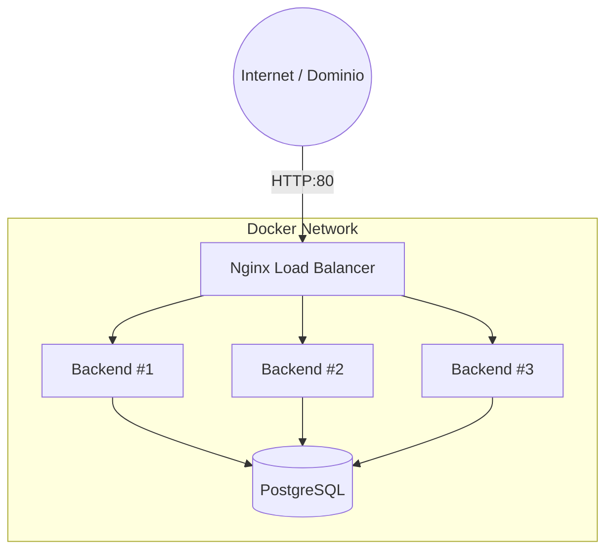
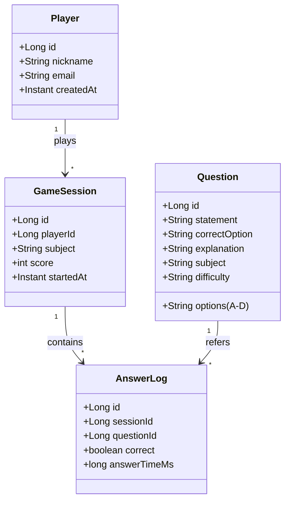

# 🧠 Trivia Quiz Backend - Full Architecture


Proyecto backend robusto para un sistema de **Trivia Quiz**. Diseñado para la preparación de exámenes y competición multijugador, optimizado para despliegue en **Raspberry Pi 5** mediante contenedores Docker con balanceo de carga.

---

## 📋 Tabla de Contenidos

1. [Arquitectura General](#-arquitectura-general)
2. [Modelo de Dominio](#-modelo-de-dominio)
3. [API REST](#-api-rest)
4. [Implementación (Código Java)](#-implementación-código-java)
5. [Despliegue (Docker & Nginx)](#-despliegue-docker--nginx)

---

## 🏗️ Arquitectura General

El sistema se compone de un cluster de aplicaciones Spring Boot stateless, gobernadas por un balanceador de carga Nginx y respaldadas por una base de datos PostgreSQL.

### Componentes
* **Backend:** Spring Boot (Stateless API).
* **Base de Datos:** PostgreSQL.
* **Balanceador:** Nginx (Round Robin).
* **Escalado:** 3 réplicas activas del backend.

### Diagrama de Infraestructura



## Tree 
```com.levelup.trivia

domain
  model
    Player.java
    Question.java
    GameSession.java
    AnswerLog.java
  port
    in
      CreateSessionUseCase.java
      AnswerQuestionUseCase.java
      FinishSessionUseCase.java
      GetRankingUseCase.java
    out
      PlayerRepositoryPort.java
      QuestionRepositoryPort.java
      SessionRepositoryPort.java
      AnswerLogRepositoryPort.java

application
  service
    CreateSessionService.java
    AnswerQuestionService.java
    FinishSessionService.java
    GetRankingService.java

infrastructure
  adapter
    in
      rest
        PlayerController.java
        QuestionController.java
        SessionController.java
    out
      persistence
        entity
        mapper
        repository
  config

TriviaApplication.java

```

---

## 📊 Modelo de Dominio

Estructura de datos relacional para gestionar preguntas, jugadores y sesiones de juego.



---

## 🌐 API REST

Path base: `/api/v1`

### 📝 Preguntas (Questions)
| Método | Endpoint | Descripción |
| :--- | :--- | :--- |
| `GET` | `/questions` | Listar todas las preguntas |
| `POST` | `/questions` | Crear nueva pregunta |
| `PUT` | `/questions/{id}` | Actualizar pregunta |
| `DELETE` | `/questions/{id}` | Eliminar pregunta |

### 👤 Jugadores (Players)
| Método | Endpoint | Descripción |
| :--- | :--- | :--- |
| `POST` | `/players` | Registrar jugador |
| `GET` | `/players/{id}` | Obtener perfil |

### 🎮 Sesiones de Juego (Game Flow)
| Método | Endpoint | Descripción |
| :--- | :--- | :--- |
| `POST` | `/sessions` | Iniciar sesión |
| `GET` | `/sessions/{id}` | Obtener estado de sesión |
| `GET` | `/sessions/{id}/next-question` | Obtener siguiente pregunta |
| `POST` | `/sessions/{id}/answer` | Enviar respuesta |
| `POST` | `/sessions/{id}/finish` | Finalizar juego |

### 🏆 Rankings
| Método | Endpoint | Descripción |
| :--- | :--- | :--- |
| `GET` | `/ranking/global` | Top puntuaciones global |
| `GET` | `/ranking/subject/{subject}` | Top por asignatura |

---

## 💻 Implementación (Código Java)

### 4.1. Main Application
```java
package com.example.quiz;

import org.springframework.boot.SpringApplication;
import org.springframework.boot.autoconfigure.SpringBootApplication;

@SpringBootApplication
public class QuizApplication {
    public static void main(String[] args) {
        SpringApplication.run(QuizApplication.class, args);
    }
}
```

### 4.2. Entidades (JPA)

<details>
<summary><b>Ver código de Entidades</b></summary>

**Question.java**
```java
@Entity
public class Question {
    @Id @GeneratedValue(strategy = GenerationType.IDENTITY)
    private Long id;
    private String statement;
    private String optionA, optionB, optionC, optionD;
    private String correctOption;
    @Column(length = 2000)
    private String explanation;
    private String subject, topic, difficulty;
    private boolean active = true;
    // getters & setters
}
```

**Player.java**
```java
@Entity
public class Player {
    @Id @GeneratedValue(strategy = GenerationType.IDENTITY)
    private Long id;
    @Column(nullable = false, unique = true)
    private String nickname;
    private String email;
    private Instant createdAt = Instant.now();
    // getters & setters
}
```

**GameSession.java**
```java
@Entity
public class GameSession {
    @Id @GeneratedValue(strategy = GenerationType.IDENTITY)
    private Long id;
    private Long playerId;
    private String subject, mode;
    private int totalQuestions, correctAnswers, score;
    private Instant startedAt = Instant.now();
    private Instant finishedAt;
    // getters & setters
}
```

**AnswerLog.java**
```java
@Entity
public class AnswerLog {
    @Id @GeneratedValue(strategy = GenerationType.IDENTITY)
    private Long id;
    private Long sessionId, questionId;
    private String selectedOption;
    private boolean correct;
    private long answerTimeMs;
    private Instant answeredAt = Instant.now();
    // getters & setters
}
```
</details>

### 4.3. Repositorios

```java
public interface QuestionRepository extends JpaRepository<Question, Long> {
    List<Question> findBySubjectAndActiveTrue(String subject);
}

public interface PlayerRepository extends JpaRepository<Player, Long> {
    boolean existsByNickname(String nickname);
}

public interface GameSessionRepository extends JpaRepository<GameSession, Long> {
    List<GameSession> findTop20ByOrderByScoreDesc();
}

public interface AnswerLogRepository extends JpaRepository<AnswerLog, Long> {
    List<AnswerLog> findBySessionId(Long sessionId);
}
```

### 4.4. Servicios (Business Logic)

<details>
<summary><b>Ver SessionService.java</b></summary>

```java
@Service
public class SessionService {
    // Dependencies injected via constructor...

    public Question nextQuestion(Long sessionId) {
        List<Question> all = questionRepo.findAll();
        return all.get(new Random().nextInt(all.size()));
    }

    public AnswerLog answer(AnswerLog log) {
        return answerRepo.save(log);
    }

    public GameSession finish(GameSession s) {
        s.setFinishedAt(Instant.now());
        return sessionRepo.save(s);
    }
}
```
</details>

---

## 🐳 Despliegue (Docker & Nginx)

Configuración para orquestar la base de datos, 3 réplicas del backend y el balanceador de carga.

### docker-compose.yml

```yaml
version: "3.9"

services:
  postgres:
    image: postgres:16
    environment:
      POSTGRES_DB: quizdb
      POSTGRES_USER: quizuser
      POSTGRES_PASSWORD: quizpass
    volumes:
      - quiz-data:/var/lib/postgresql/data
    networks:
      - quiz-net

  # Replicas del Backend
  quiz-backend-1:
    build: ./backend
    environment: &backend_env
      SPRING_DATASOURCE_URL: jdbc:postgresql://postgres:5432/quizdb
      SPRING_DATASOURCE_USERNAME: quizuser
      SPRING_DATASOURCE_PASSWORD: quizpass
    networks:
      - quiz-net

  quiz-backend-2:
    build: ./backend
    environment: *backend_env
    networks:
      - quiz-net

  quiz-backend-3:
    build: ./backend
    environment: *backend_env
    networks:
      - quiz-net

  nginx:
    build: ./nginx
    ports:
      - "80:80"
    networks:
      - quiz-net

networks:
  quiz-net:

volumes:
  quiz-data:
```

### Configuración Nginx (`nginx.conf`)

Define el grupo de servidores (upstream) para el balanceo de carga.

```nginx
events {}

http {
    upstream quiz_backend {
        server quiz-backend-1:8080;
        server quiz-backend-2:8080;
        server quiz-backend-3:8080;
    }

    server {
        listen 80;
        
        location / {
            proxy_pass http://quiz_backend;
            proxy_set_header Host $host;
            proxy_set_header X-Real-IP $remote_addr;
        }
    }
}
```

### Estructura de Archivos

```text
quiz-trivia-backend/
├── backend/
│   ├── Dockerfile
│   ├── pom.xml
│   └── src/main/java/com/example/quiz/...
├── nginx/
│   ├── Dockerfile
│   └── nginx.conf
└── docker-compose.yml
```