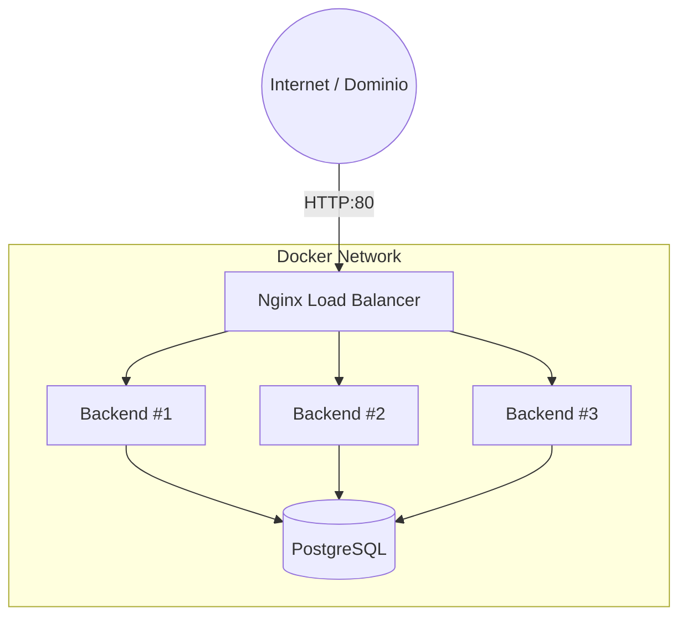
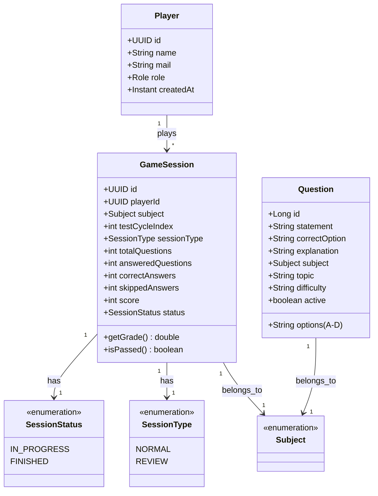
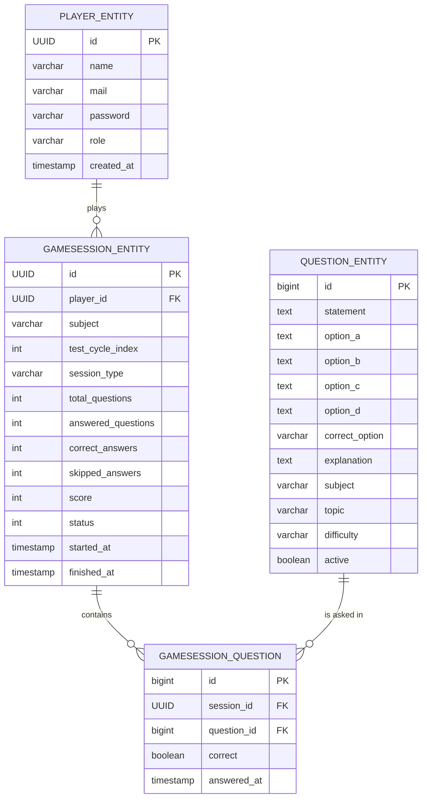

# 🧠 Trivia Quiz Backend - Full Architecture


Proyecto backend robusto para un sistema de **Trivia Quiz**. Diseñado para la preparación de exámenes y competición multijugador, optimizado para despliegue en **Raspberry Pi 5** mediante contenedores Docker con balanceo de carga.

---

## 📋 Tabla de Contenidos

1. [Arquitectura General](#-arquitectura-general)
2. [Modelo de Dominio](#-modelo-de-dominio)
3. [API REST](#-api-rest)
4. [Implementación (Código Java)](#-implementación-código-java)
5. [Despliegue (Docker & Nginx)](#-despliegue-docker--nginx)
6. [Documentación Adjunta](#-documentación-adjunta)

---

## 🏗️ Arquitectura General

El sistema se compone de un cluster de aplicaciones Spring Boot stateless, gobernadas por un balanceador de carga Nginx y respaldadas por una base de datos PostgreSQL.

### Componentes
* **Backend:** Spring Boot (Stateless API) con **Arquitectura Hexagonal**.
* **Seguridad:** Spring Security con **JWT** (JSON Web Tokens) y RBAC (Rol-Based Access Control).
* **Base de Datos:** PostgreSQL.
* **Proxy Inverso:** Nginx (Proxy inverso para cazar IPs y enmascarar puertos).
* **Escalado:** 3 réplicas activas del backend.

### Diagrama de Infraestructura



## 🌳 Árbol de Clases y Paquetes Principales

```text
levelup42.trivia/
├── TriviaApplication.java
├── domain/
│   ├── model/
│   │   ├── GameSession.java
│   │   ├── Player.java
│   │   ├── Question.java
│   │   ├── SessionStatus.java
│   │   ├── SessionType.java
│   │   └── Subject.java
│   ├── port/
│   │   ├── in/
│   │   │   ├── auth/
│   │   │   ├── gamesession/
│   │   │   ├── player/
│   │   │   └── question/
│   │   └── out/
│   │       ├── GameSessionRepositoryPort.java
│   │       ├── PlayerRepositoryPort.java
│   │       └── QuestionRepositoryPort.java
│   └── exception/
│
├── application/
│   └── service/
│       ├── auth/
│       ├── gamesession/
│       ├── player/
│       └── question/
│
└── infraestructure/
    ├── adapter/
    │   ├── in/rest/
    │   │   ├── AuthController.java
    │   │   ├── GameSessionController.java
    │   │   ├── PlayerController.java
    │   │   ├── QuestionController.java
    │   │   └── dto/
    │   │
    │   └── out/persistence/
    │       ├── GameSessionJpaAdapter.java
    │       ├── PlayerJpaAdapter.java
    │       ├── QuestionJpaAdapter.java
    │       ├── entity/
    │       │   ├── GameSessionEntity.java
    │       │   ├── GameSessionQuestionEntity.java
    │       │   ├── PlayerEntity.java
    │       │   └── QuestionEntity.java
    │       ├── mapper/
    │       └── repository/
    │           ├── DataGameSessionQuestionRepository.java
    │           ├── DataGameSessionRepository.java
    │           ├── DataPlayerRepository.java
    │           └── DataQuestionRepository.java
    │
    ├── config/
    │   ├── exception/
    │   ├── CorsConfig.java
    │   ├── DebugExceptionHandler.java
    │   └── OpenApiConfig.java
    │
    └── security/
        ├── firebase/
        ├── google/
        ├── jwt/
        ├── CustomUserDetails.java
        └── SecurityConfig.java
```

---

## 📊 Modelo de Dominio

Estructura de datos central para gestionar preguntas, jugadores y el estado de cada sesión de juego.



---

## 💾 Modelo de Base de Datos (Entities)

La capa de persistencia se modela utilizando Spring Data JPA y Hibernate. A continuación se detalla el esquema relacional. La entidad `GAMESESSION_QUESTION` es crucial ya que actúa como tabla intermedia para saber exactamente qué preguntas ha respondido cada jugador en cada test, permitiendo implementar la "Bolsa de Fallos" y la evaluación.



---

## 🌐 API REST

Path base: `/api/v1`

### 📝 Preguntas (Questions)
| Método | Endpoint | Descripción | Seguridad |
| :--- | :--- | :--- | :--- |
| `GET` | `/question` | Listar todas las preguntas | Público |
| `POST` | `/question` | Crear nueva pregunta | **ADMIN** |
| `PUT` | `/question/{id}` | Actualizar pregunta | **ADMIN** |
| `DELETE` | `/question/{id}` | Eliminar pregunta (Soft Delete) | **ADMIN** |

### 👤 Jugadores y Autenticación (Auth / Players)
| Método | Endpoint | Descripción | Seguridad |
| :--- | :--- | :--- | :--- |
| `POST` | `/auth/google` | Autenticación con Firebase/Google y obtención de JWT propio | Público |
| `GET` | `/players` | Listar todos los jugadores | Requiere Token |
| `GET` | `/players/{id}` | Obtener perfil de un jugador | Requiere Token |

### 🎮 Sesiones de Juego (Game Flow)
| Método | Endpoint | Descripción | Seguridad |
| :--- | :--- | :--- | :--- |
| `POST` | `/session` | Iniciar nueva sesión de juego | Requiere Token |
| `GET` | `/session/{sessionId}` | Obtener detalles y estado (incluye nota) | Requiere Token |
| `GET` | `/session/{sessionId}/next-question` | Obtener siguiente pregunta (oculta correcta) | Requiere Token |
| `POST` | `/session/{sessionId}/answer` | Enviar una respuesta y evaluar acierto | Requiere Token |
| `POST` | `/session/{sessionId}/finish` | Finalizar explícitamente una sesión en curso | Requiere Token |
| `GET` | `/session/player/{playerId}` | Historial de sesiones jugadas por un jugador | Requiere Token |
| `GET` | `/session/leaderboard` | Clasificación global de sesiones finalizadas | Requiere Token |

---

## 💻 Implementación de Arquitectura Hexagonal (Código Java)

### 4.1. Main Application
```java
package levelup42.trivia;

import org.springframework.boot.SpringApplication;
import org.springframework.boot.autoconfigure.SpringBootApplication;

@SpringBootApplication
public class TriviaApplication {
    public static void main(String[] args) {
        SpringApplication.run(TriviaApplication.class, args);
    }
}
```

### 4.2. Dominio y Casos de Uso (Núcleo)

<details>
<summary><b>Ver código de Dominio</b></summary>

**GameSession.java** (Sin dependencias externas, pura lógica de negocio)
```java
package levelup42.trivia.domain.model;

public class GameSession {
    private final UUID id;
    private final UUID playerId;
    private final String subjet;
    private int totalQuestions, answeredQuestions, correctAnswers, score;
    private SessionStatus status;

    public void registerCorrectAnswer(int points) {
        this.correctAnswers++;
        this.score += points;
        this.answeredQuestions++;
    }

    public void registerIncorrectAnswer() {
        this.answeredQuestions++;
    }

    public double getGrade() {
        if (totalQuestions == 0) return 0.0;
        double questionValue = 10.0 / totalQuestions;
        double penaltyValue = questionValue / 3.0; // Resta 1/3 por fallo
        int incorrectAnswers = answeredQuestions - correctAnswers;
        double rawGrade = (correctAnswers * questionValue) - (incorrectAnswers * penaltyValue);
        return Math.max(0.0, Math.min(10.0, rawGrade));
    }
    
    public boolean isPassed() {
        return getGrade() >= 5.0;
    }
    // ...
}
```

**GameSessionRepositoryPort.java** (Puerto de salida)
```java
package levelup42.trivia.domain.port.out;

import levelup42.trivia.domain.model.GameSession;
import java.util.Optional;
import java.util.UUID;

public interface GameSessionRepositoryPort {
    GameSession save(GameSession gameSession);
    Optional<GameSession> findById(UUID id);
    // ...
}
```

**SubmitAnswerUseCase.java** (Puerto de entrada)
```java
package levelup42.trivia.domain.port.in.gamesession;

import java.util.UUID;

public interface SubmitAnswerUseCase {
    boolean execute(UUID sessionId, Long questionId, String selectedOption);
}
```
</details>

### 4.3. Servicios (Capa de Aplicación)

<details>
<summary><b>Ver SubmitAnswerService.java</b></summary>

```java
package levelup42.trivia.application.service.gamesession;

import levelup42.trivia.domain.port.in.gamesession.SubmitAnswerUseCase;
import org.springframework.stereotype.Service;

@Service
public class SubmitAnswerService implements SubmitAnswerUseCase {
    private final GameSessionRepositoryPort sessionRepository;
    private final QuestionRepositoryPort questionRepository;
    // ... dependencies via constructor
    
    @Override
    public boolean execute(UUID sessionId, Long questionId, String option) {
        GameSession session = sessionRepository.findById(sessionId).orElseThrow();
        Question question = questionRepository.findById(questionId).orElseThrow();
        
        boolean isCorrect = question.getCorrectOption().equals(option);
        if (isCorrect) session.registerCorrectAnswer(10);
        else session.registerIncorrectAnswer();
        
        sessionRepository.save(session);
        return isCorrect;
    }
}
```
</details>

### 4.4. Infraestructura y Configuración (`config/`)

El paquete `infraestructure/config/` y `infraestructure/security/` centralizan la configuración del framework y la seguridad de la aplicación:

*   **`SecurityConfig.java`**: Configura Spring Security (stateless) activando los filtros JWT y securizando los endpoints en función a su Rol (`@PreAuthorize("hasRole('ADMIN')")`).
*   **`JwtAuthenticationFilter.java`**: Filtro transversal JWT para interceptar cada petición REST y extraer/validar el token en la cabecera `Authorization`. Autoriza el contexto de ejecución del hilo concurrente.
*   **`CorsConfig.java`**: Define las políticas de **CORS (Cross-Origin Resource Sharing)**, permitiendo especificar orígenes, métodos y cabeceras autorizados.
*   **`OpenApiConfig.java`**: Integra y configura **Swagger / OpenAPI 3**, generando y sirviendo de forma automática la documentación interactiva y los esquemas del API REST al inyectar el token JWT global.
*   **`GlobalExceptionHandler.java`**: Gestiona las excepciones de manera global, interceptando accesos denegados (403), no autorizados (401) o fallos de dominio (409) para que el servidor nunca se caiga y no exponga trazas a atacantes potenciales.

---

## 🐳 Despliegue (Docker & Nginx)

Configuración para orquestar la base de datos, 3 réplicas del backend y el balanceador de carga.

### docker-compose.yml

```yaml
version: "3.9"

services:
  postgres:
    image: postgres:16
    environment:
      POSTGRES_DB: quizdb
      POSTGRES_USER: quizuser
      POSTGRES_PASSWORD: quizpass
    volumes:
      - quiz-data:/var/lib/postgresql/data
    networks:
      - quiz-net

  # Replicas del Backend
  quiz-backend-1:
    build: ./backend
    environment: &backend_env
      SPRING_DATASOURCE_URL: jdbc:postgresql://postgres:5432/quizdb
      SPRING_DATASOURCE_USERNAME: quizuser
      SPRING_DATASOURCE_PASSWORD: quizpass
    networks:
      - quiz-net

  quiz-backend-2:
    build: ./backend
    environment: *backend_env
    networks:
      - quiz-net

  quiz-backend-3:
    build: ./backend
    environment: *backend_env
    networks:
      - quiz-net

  nginx:
    build: ./nginx
    ports:
      - "80:80"
    networks:
      - quiz-net

networks:
  quiz-net:

volumes:
  quiz-data:
```

### Configuración Nginx (`nginx.conf`)

Define el grupo de servidores (upstream) para el balanceo de carga.

```nginx
events {}

http {
    upstream quiz_backend {
        server quiz-backend-1:8080;
        server quiz-backend-2:8080;
        server quiz-backend-3:8080;
    }

    server {
        listen 80;
        
        location / {
            proxy_pass http://quiz_backend;
            proxy_set_header Host $host;
            proxy_set_header X-Real-IP $remote_addr;
        }
    }
}
```

### Estructura de Archivos

```text
quiz-trivia-backend/
├── backend/
│   ├── Dockerfile
│   ├── pom.xml
│   └── src/main/java/com/example/quiz/...
├── nginx/
│   ├── Dockerfile
│   └── nginx.conf
└── docker-compose.yml
```

---

## 📚 Documentación Adjunta

Para obtener detalles más profundos sobre la configuración, estrategias algorítmicas y el historial de desarrollo, puedes consultar los archivos disponibles en la carpeta `/documentacion`:

*   **[01_guia_instalacion.md](./documentacion/01_guia_instalacion.md)**: Pasos exhaustivos para la configuración, compilación y despliegue del entorno en producción o local.
*   **[02_desarrollo_api.md](./documentacion/02_desarrollo_api.md)**: Notas de diseño, decisiones arquitectónicas y consideraciones sobre el desarrollo de la API REST.
*   **[03_autenticacion_firebase.md](./documentacion/03_autenticacion_firebase.md)**: Detalles sobre el flujo de seguridad y la integración de tokens JWT con Google Firebase.
*   **[04_estrategia_pool_preguntas.md](./documentacion/04_estrategia_pool_preguntas.md)**: Explicación algorítmica sobre la selección de preguntas para tests estándar (incluye la ventana de exclusión de 96 horas).
*   **[05_logica_tests_repaso.md](./documentacion/05_logica_tests_repaso.md)**: Mecánica, consulta JPQL y estrategia FIFO implementada para vaciar progresivamente el historial de fallos del jugador.
*   **[historial_sprints/](./documentacion/historial_sprints/)**: Subcarpeta que contiene bitácoras de desarrollo, planes de implementación y cierres de sprints diarios.