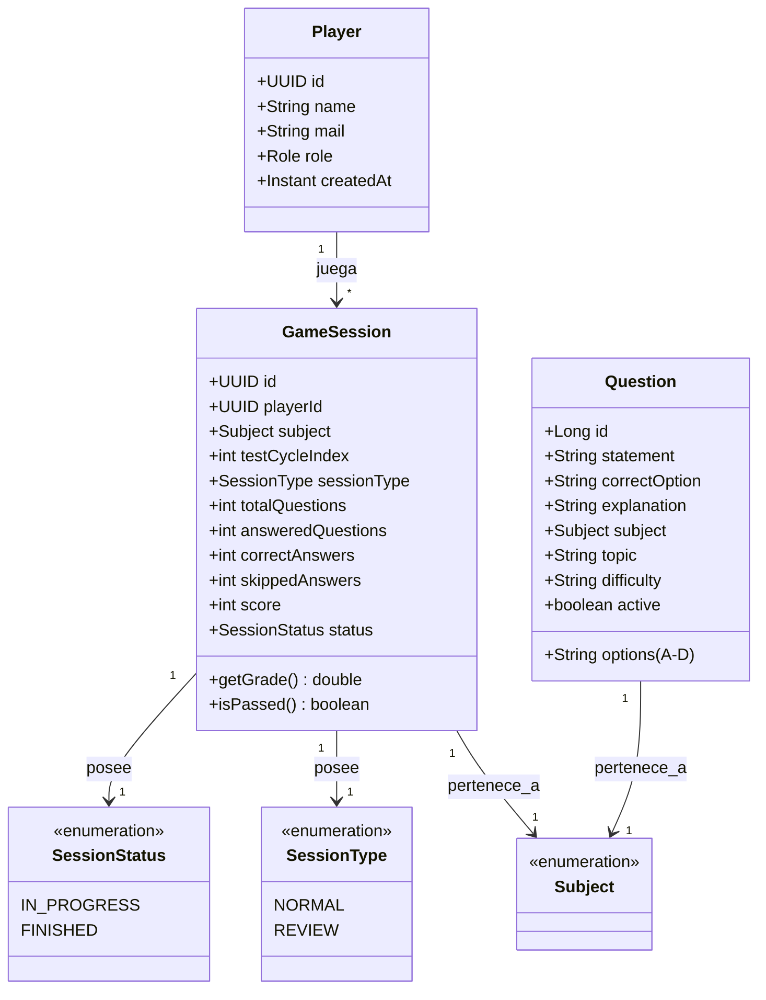
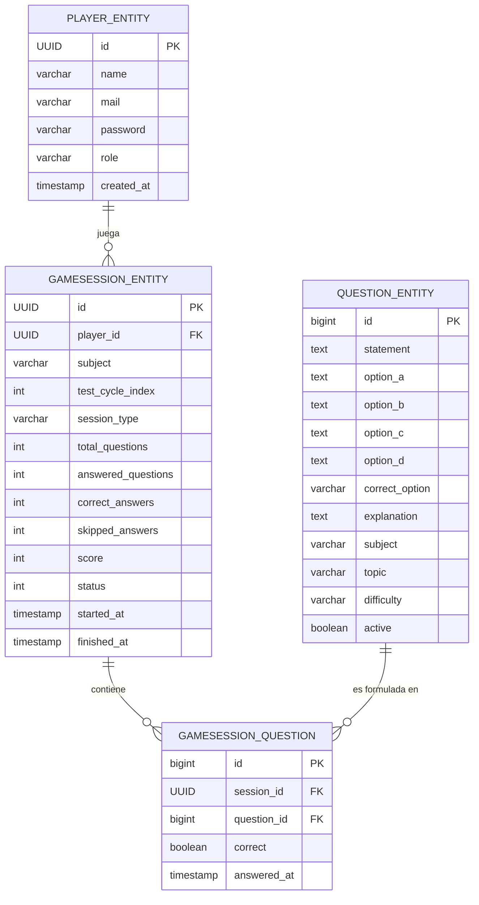

# 🧠 Trivia Quiz Backend — Architectural Showcase & Hexagonal Engine


> **Resumen Ejecutivo**:  
> **TriviaQuiz Backend** es una plataforma distribuida de alta disponibilidad orientada a la preparación de exámenes competitivos y trivias multijugador. Diseñada siguiendo los principios de la **Arquitectura Hexagonal (Puertos y Adaptadores)**, la plataforma garantiza desacoplamiento absoluto del framework en el núcleo de dominio, tolerancia a fallos mediante réplicas sin estado (*stateless*), balanceo de carga con Nginx y optimización de recursos para despliegue en entornos de bajo consumo como **Raspberry Pi 5**.

---

## 📋 Tabla de Contenidos

1. [✨ Características Principales & Algoritmos](#-características-principales--algoritmos)
2. [🏗️ Arquitectura General & Sistema de Balanceo](#️-arquitectura-general--sistema-de-balanceo)
3. [🌳 Árbol de Clases y Estructura de Paquetes](#-árbol-de-clases-y-estructura-de-paquetes)
4. [📊 Modelo de Dominio y Diagrama de Clases](#-modelo-de-dominio-y-diagrama-de-clases)
5. [💾 Modelo de Base de Datos (Entidades JPA)](#-modelo-de-base-de-datos-entidades-jpa)
6. [🌐 Especificación de la API REST](#-especificación-de-la-api-rest)
7. [💻 Código de la Arquitectura Hexagonal](#-código-de-la-arquitectura-hexagonal)
8. [🐳 Despliegue de Infraestructura (Docker & Nginx)](#-despliegue-de-infraestructura-docker--nginx)
9. [📚 Documentación Técnica Adjunta](#-documentación-técnica-adjunta)

---

## ✨ Características Principales & Algoritmos

### 🎯 1. Algoritmo de Exclusión Temporal de Preguntas (Ventana 96h)
Para evitar la memorización por repetición continua, el motor de generación de exámenes filtra dinámicamente el *pool* de preguntas excluyendo aquellas que el jugador haya respondido dentro de una ventana deslizante de **96 horas**, asegurando evaluaciones genuinas y variadas.

### 🔄 2. Modo Repaso Inteligente ("Bolsa de Fallos" FIFO)
Sistema automatizado de refuerzo que recopila las preguntas falladas por cada jugador. Mediante consultas JPQL optimizadas y estructuras FIFO (*First In, First Out*), el jugador puede realizar *tests de repaso* dedicados que vacían progresivamente su historial de errores a medida que acierta las respuestas.

### 🔐 3. Seguridad Stateless & OAuth2 / JWT
Integración híbrida de autenticación: soporta inicio de sesión social con **Google / Firebase Auth**, intercambiado transparentemente por tokens **JWT propietarios** firmados criptográficamente. Control de acceso granular basado en roles (RBAC: `ROLE_USER`, `ROLE_ADMIN`).

### ⚡ 4. Balanceo de Carga & Despliegue en Hardware ARM64
Clúster distribuido en Docker compuesto por 3 réplicas del backend Spring Boot balanceadas mediante Nginx. Optimizado para ofrecer latencias subsegundo sobre hardware **Raspberry Pi 5 (ARM64)** con PostgreSQL 16 ajustado para bajo consumo de memoria.

---

## 🏗️ Arquitectura General & Sistema de Balanceo

La aplicación adopta el patrón de **Puertos y Adaptadores (Arquitectura Hexagonal)**. El núcleo del sistema (`domain`) no posee dependencias hacia Spring Boot, JPA, Jackson o bibliotecas de terceros, garantizando mantenibilidad, testabilidad unitaria aislada y portabilidad.

```mermaid
graph TD
    User((🌐 Cliente REST / PWA)) -->|HTTP:80| Nginx[Balanceador Nginx (Reverse Proxy)]
    
    subgraph Docker Cluster (Red Interna isolada)
        Nginx -->|Upstream Round-Robin| B1[Backend Instance #1<br/>Spring Boot Container]
        Nginx -->|Upstream Round-Robin| B2[Backend Instance #2<br/>Spring Boot Container]
        Nginx -->|Upstream Round-Robin| B3[Backend Instance #3<br/>Spring Boot Container]
        
        B1 --> DB[(PostgreSQL 16 Engine)]
        B2 --> DB
        B3 --> DB
    end
```

---

## 🌳 Árbol de Clases y Estructura de Paquetes

```text
levelup42.trivia/
├── TriviaApplication.java                     # Punto de entrada Spring Boot
├── domain/                                    # NÚCLEO DE DOMINIO (Puro Java, 0 dependencias)
│   ├── model/                                 # Entidades de Dominio
│   │   ├── GameSession.java
│   │   ├── Player.java
│   │   ├── Question.java
│   │   ├── SessionStatus.java
│   │   ├── SessionType.java
│   │   └── Subject.java
│   ├── port/                                  # Puertos (Interfaces de entrada y salida)
│   │   ├── in/                                # Puertos de Entrada (Use Cases)
│   │   │   ├── auth/
│   │   │   ├── gamesession/
│   │   │   ├── player/
│   │   │   └── question/
│   │   └── out/                               # Puertos de Salida (Repositories / SPI)
│   │       ├── GameSessionRepositoryPort.java
│   │       ├── PlayerRepositoryPort.java
│   │       └── QuestionRepositoryPort.java
│   └── exception/                             # Excepciones de negocio
│
├── application/                               # CAPA DE APLICACIÓN (Casos de Uso / Servicios)
│   └── service/                               # Servicios que implementan Puertos de Entrada
│       ├── auth/
│       ├── gamesession/
│       ├── player/
│       └── question/
│
└── infrastructure/                            # CAPA DE INFRAESTRUCTURA (Frameworks & Drivers)
    ├── adapter/
    │   ├── in/rest/                           # Adaptadores REST (Controladores Controllers & DTOs)
    │   │   ├── AuthController.java
    │   │   ├── GameSessionController.java
    │   │   ├── PlayerController.java
    │   │   ├── QuestionController.java
    │   │   └── dto/
    │   └── out/persistence/                   # Adaptadores de Persistencia (Spring Data JPA)
    │       ├── GameSessionJpaAdapter.java
    │       ├── PlayerJpaAdapter.java
    │       ├── QuestionJpaAdapter.java
    │       ├── entity/                        # Entidades Relacionales JPA
    │       ├── mapper/                        # Mapeadores Entity <-> Domain
    │       └── repository/                    # Interfaces Spring Data Repositories
    ├── config/                                # Configuración de Spring, OpenAPI / Swagger
    └── security/                              # Filtros Spring Security, JWT y Firebase
```

---

## 📊 Modelo de Dominio y Diagrama de Clases

El modelo de dominio encapsula las reglas de puntuación, cálculo de notas con penalizaciones (resta 1/3 de valor por fallo) e indicadores de aprobación.


```mermaid
classDiagram
    class Question {
        +Long id
        +String statement
        +String options (A-D)
        +String correctOption
        +String explanation
        +Subject subject
        +String topic
        +String difficulty
        +boolean active
    }
    class Player {
        +UUID id
        +String name
        +String mail
        +Role role
        +Instant createdAt
    }
    class GameSession {
        +UUID id
        +UUID playerId
        +Subject subject
        +int testCycleIndex
        +SessionType sessionType
        +int totalQuestions
        +int answeredQuestions
        +int correctAnswers
        +int skippedAnswers
        +int score
        +SessionStatus status
        +getGrade() double
        +isPassed() boolean
    }
    class SessionStatus {
        <<enumeration>>
        IN_PROGRESS
        FINISHED
    }
    class SessionType {
        <<enumeration>>
        NORMAL
        REVIEW
    }
    class Subject {
        <<enumeration>>
    }
    
    Player "1" --> "*" GameSession : juega
    GameSession "1" --> "1" SessionStatus : posee
    GameSession "1" --> "1" SessionType : posee
    GameSession "1" --> "1" Subject : pertenece_a
    Question "1" --> "1" Subject : pertenece_a
```

---

## 💾 Modelo de Base de Datos (Entidades JPA)

La persistencia relacional utiliza Spring Data JPA y Hibernate sobre PostgreSQL 16. La tabla intermedia `GAMESESSION_QUESTION` es fundamental ya que registra el historial de respuestas individuales por sesión para alimentar el motor de repaso.


```mermaid
erDiagram
    PLAYER_ENTITY ||--o{ GAMESESSION_ENTITY : "juega"
    GAMESESSION_ENTITY ||--o{ GAMESESSION_QUESTION : "contiene"
    QUESTION_ENTITY ||--o{ GAMESESSION_QUESTION : "es formulada en"

    PLAYER_ENTITY {
        UUID id PK
        varchar name
        varchar mail
        varchar password
        varchar role
        timestamp created_at
    }
    QUESTION_ENTITY {
        bigint id PK
        text statement
        text option_a
        text option_b
        text option_c
        text option_d
        varchar correct_option
        text explanation
        varchar subject
        varchar topic
        varchar difficulty
        boolean active
    }
    GAMESESSION_ENTITY {
        UUID id PK
        UUID player_id FK
        varchar subject
        int test_cycle_index
        varchar session_type
        int total_questions
        int answered_questions
        int correct_answers
        int skipped_answers
        int score
        int status
        timestamp started_at
        timestamp finished_at
    }
    GAMESESSION_QUESTION {
        bigint id PK
        UUID session_id FK
        bigint question_id FK
        boolean correct
        timestamp answered_at
    }
```

---

## 🌐 Especificación de la API REST

Path base: `/api/v1`

### 📝 1. Gestión de Preguntas (`/question`)
| Método | Endpoint | Descripción | Requisito de Autenticación |
| :--- | :--- | :--- | :--- |
| `GET` | `/question` | Listar todas las preguntas del sistema | Público |
| `POST` | `/question` | Crear una nueva pregunta en el catálogo | **ADMIN** (`ROLE_ADMIN`) |
| `PUT` | `/question/{id}` | Actualizar enunciado, opciones o solución | **ADMIN** (`ROLE_ADMIN`) |
| `DELETE` | `/question/{id}` | Eliminar pregunta (Soft Delete) | **ADMIN** (`ROLE_ADMIN`) |

### 👤 2. Autenticación y Jugadores (`/auth`, `/players`)
| Método | Endpoint | Descripción | Requisito de Autenticación |
| :--- | :--- | :--- | :--- |
| `POST` | `/auth/google` | Autenticar token Firebase/Google y emitir JWT propio | Público |
| `GET` | `/players` | Obtener listado de jugadores registrados | Autenticado (`JWT`) |
| `GET` | `/players/{id}` | Obtener perfil detallado de un jugador | Autenticado (`JWT`) |

### 🎮 3. Flujo de Sesión de Juego (`/session`)
| Método | Endpoint | Descripción | Requisito de Autenticación |
| :--- | :--- | :--- | :--- |
| `POST` | `/session` | Iniciar una nueva sesión de examen/trivia | Autenticado (`JWT`) |
| `GET` | `/session/{sessionId}` | Consultar estado, progreso y nota actual | Autenticado (`JWT`) |
| `GET` | `/session/{sessionId}/next-question` | Obtener la siguiente pregunta (sin solución) | Autenticado (`JWT`) |
| `POST` | `/session/{sessionId}/answer` | Enviar respuesta y procesar acierto/penalización | Autenticado (`JWT`) |
| `POST` | `/session/{sessionId}/finish` | Finalizar explícitamente la sesión de juego | Autenticado (`JWT`) |
| `GET` | `/session/player/{playerId}` | Obtener historial completo de sesiones del jugador | Autenticado (`JWT`) |
| `GET` | `/session/leaderboard` | Obtener tabla global de clasificación (*Leaderboard*) | Autenticado (`JWT`) |

---

## 💻 Código de la Arquitectura Hexagonal

### 4.1. Clase Principal (Spring Boot Application)
```java
package levelup42.trivia;

import org.springframework.boot.SpringApplication;
import org.springframework.boot.autoconfigure.SpringBootApplication;

@SpringBootApplication
public class TriviaApplication {
    public static void main(String[] args) {
        SpringApplication.run(TriviaApplication.class, args);
    }
}
```

### 4.2. Capa de Dominio (Núcleo Puro sin Frameworks)

<details>
<summary><b> Ver código de la Entidad de Dominio GameSession.java</b></summary>

```java
package levelup42.trivia.domain.model;

import java.util.UUID;

/**
 * Entidad pura de dominio.
 * No contiene anotaciones JPA (@Entity, @Table) ni dependencias de Spring.
 */
public class GameSession {
    private final UUID id;
    private final UUID playerId;
    private final Subject subject;
    private int totalQuestions;
    private int answeredQuestions;
    private int correctAnswers;
    private int score;
    private SessionStatus status;

    public GameSession(UUID id, UUID playerId, Subject subject, int totalQuestions) {
        this.id = id;
        this.playerId = playerId;
        this.subject = subject;
        this.totalQuestions = totalQuestions;
        this.answeredQuestions = 0;
        this.correctAnswers = 0;
        this.score = 0;
        this.status = SessionStatus.IN_PROGRESS;
    }

    public void registerCorrectAnswer(int points) {
        this.correctAnswers++;
        this.score += points;
        this.answeredQuestions++;
    }

    public void registerIncorrectAnswer() {
        this.answeredQuestions++;
    }

    /**
     * Calcula la nota sobre 10 aplicando fórmula de penalización por fallos (resta 1/3 de pregunta acotado a [0.0, 10.0]).
     */
    public double getGrade() {
        if (totalQuestions == 0) return 0.0;
        double questionValue = 10.0 / totalQuestions;
        double penaltyValue = questionValue / 3.0;
        int incorrectAnswers = answeredQuestions - correctAnswers;
        double rawGrade = (correctAnswers * questionValue) - (incorrectAnswers * penaltyValue);
        return Math.max(0.0, Math.min(10.0, rawGrade));
    }

    public boolean isPassed() {
        return getGrade() >= 5.0;
    }

    // Getters y métodos de estado de dominio
    public UUID getId() { return id; }
    public UUID getPlayerId() { return playerId; }
    public SessionStatus getStatus() { return status; }
}
```
</details>

<details>
<summary><b> Ver código del Puerto de Salida GameSessionRepositoryPort.java</b></summary>

```java
package levelup42.trivia.domain.port.out;

import levelup42.trivia.domain.model.GameSession;
import java.util.Optional;
import java.util.UUID;

public interface GameSessionRepositoryPort {
    GameSession save(GameSession gameSession);
    Optional<GameSession> findById(UUID id);
}
```
</details>

<details>
<summary><b> Ver código del Puerto de Entrada SubmitAnswerUseCase.java</b></summary>

```java
package levelup42.trivia.domain.port.in.gamesession;

import java.util.UUID;

public interface SubmitAnswerUseCase {
    boolean execute(UUID sessionId, Long questionId, String selectedOption);
}
```
</details>

### 4.3. Capa de Aplicación (Servicios de Casos de Uso)

<details>
<summary><b> Ver código del Servicio SubmitAnswerService.java</b></summary>

```java
package levelup42.trivia.application.service.gamesession;

import levelup42.trivia.domain.model.GameSession;
import levelup42.trivia.domain.model.Question;
import levelup42.trivia.domain.port.in.gamesession.SubmitAnswerUseCase;
import levelup42.trivia.domain.port.out.GameSessionRepositoryPort;
import levelup42.trivia.domain.port.out.QuestionRepositoryPort;
import org.springframework.stereotype.Service;

import java.util.UUID;

@Service
public class SubmitAnswerService implements SubmitAnswerUseCase {

    private final GameSessionRepositoryPort sessionRepository;
    private final QuestionRepositoryPort questionRepository;

    public SubmitAnswerService(GameSessionRepositoryPort sessionRepository, 
                                QuestionRepositoryPort questionRepository) {
        this.sessionRepository = sessionRepository;
        this.questionRepository = questionRepository;
    }

    @Override
    public boolean execute(UUID sessionId, Long questionId, String selectedOption) {
        GameSession session = sessionRepository.findById(sessionId)
                .orElseThrow(() -> new IllegalArgumentException("Sesión no encontrada"));
        Question question = questionRepository.findById(questionId)
                .orElseThrow(() -> new IllegalArgumentException("Pregunta no encontrada"));

        boolean isCorrect = question.getCorrectOption().equalsIgnoreCase(selectedOption);
        
        if (isCorrect) {
            session.registerCorrectAnswer(10);
        } else {
            session.registerIncorrectAnswer();
        }

        sessionRepository.save(session);
        return isCorrect;
    }
}
```
</details>

### 4.4. Capa de Infraestructura & Seguridad (`infrastructure/`)

La capa `infrastructure/config/` y `infrastructure/security/` gestiona el framework Spring Boot y la protección perimetral:

* **`SecurityConfig.java`**: Configuración de Spring Security sin estado (*stateless*), deshabilitando sesiones de cookies, inyectando los filtros JWT y securizando rutas con anotaciones `@PreAuthorize("hasRole('ADMIN')")`.
* **`JwtAuthenticationFilter.java`**: Interceptor transversal HTTP para validar la firma y caducidad del token en la cabecera `Authorization: Bearer <token>`.
* **`CorsConfig.java`**: Control de políticas CORS (*Cross-Origin Resource Sharing*) autorizando accesos web y móviles específicos.
* **`OpenApiConfig.java`**: Generación automática de especificación Swagger / OpenAPI 3 con soporte para inyección de token global.
* **`GlobalExceptionHandler.java`**: Manejador global de excepciones para traducir fallos de dominio o seguridad en códigos HTTP estandarizados (401, 403, 404, 409) impidiendo la filtración de trazas internas.

---

## 🐳 Despliegue de Infraestructura (Docker & Nginx)

Configuración de contenedores en Docker Compose para levantar PostgreSQL 16, 3 réplicas sin estado del backend y el balanceador de carga Nginx.

### `docker-compose.yml`

```yaml
version: "3.9"

services:
  postgres:
    image: postgres:16-alpine
    container_name: quiz-postgres
    restart: always
    environment:
      POSTGRES_DB: quizdb
      POSTGRES_USER: quizuser
      POSTGRES_PASSWORD: quizpass
    volumes:
      - quiz-data:/var/lib/postgresql/data
    networks:
      - quiz-net

  # Instancia Backend #1
  quiz-backend-1:
    build: ./backend
    container_name: quiz-backend-1
    restart: always
    environment: &backend_env
      SPRING_DATASOURCE_URL: jdbc:postgresql://postgres:5432/quizdb
      SPRING_DATASOURCE_USERNAME: quizuser
      SPRING_DATASOURCE_PASSWORD: quizpass
    networks:
      - quiz-net
    depends_on:
      - postgres

  # Instancia Backend #2
  quiz-backend-2:
    build: ./backend
    container_name: quiz-backend-2
    restart: always
    environment: *backend_env
    networks:
      - quiz-net
    depends_on:
      - postgres

  # Instancia Backend #3
  quiz-backend-3:
    build: ./backend
    container_name: quiz-backend-3
    restart: always
    environment: *backend_env
    networks:
      - quiz-net
    depends_on:
      - postgres

  # Balanceador de Carga Nginx
  nginx:
    build: ./nginx
    container_name: quiz-nginx
    restart: always
    ports:
      - "80:80"
    networks:
      - quiz-net
    depends_on:
      - quiz-backend-1
      - quiz-backend-2
      - quiz-backend-3

networks:
  quiz-net:
    driver: bridge

volumes:
  quiz-data:
```

### Configuración Nginx (`nginx.conf`)

Configuración del bloque `upstream` para distribución *Round-Robin* del tráfico hacia las 3 réplicas backend.

```nginx
events {
    worker_connections 1024;
}

http {
    upstream quiz_backend {
        server quiz-backend-1:8080;
        server quiz-backend-2:8080;
        server quiz-backend-3:8080;
    }

    server {
        listen 80;
        
        location / {
            proxy_pass http://quiz_backend;
            proxy_set_header Host $host;
            proxy_set_header X-Real-IP $remote_addr;
            proxy_set_header X-Forwarded-For $proxy_add_x_forwarded_for;
            proxy_set_header X-Forwarded-Proto $scheme;
        }
    }
}
```

---

## 📚 Documentación Técnica Adjunta

Para profundizar en la arquitectura, algoritmos de selección y guías de despliegue, consulta la documentación disponible en la carpeta `/documentacion`:

* 📖 **[01_guia_instalacion.md](./documentacion/01_guia_instalacion.md)**: Guía paso a paso para compilación y puesta en marcha en entorno local o Raspberry Pi.
* 🛠️ **[02_desarrollo_api.md](./documentacion/02_desarrollo_api.md)**: Especificación ampliada de DTOs, códigos de respuesta y diseño REST.
* 🔑 **[03_autenticacion_firebase.md](./documentacion/03_autenticacion_firebase.md)**: Flujo de intercambio de tokens entre Firebase OAuth2 y JWT.
* 🎲 **[04_estrategia_pool_preguntas.md](./documentacion/04_estrategia_pool_preguntas.md)**: Detalles algorítmicos del filtro temporal de 96 horas y distribución aleatoria.
* 🔄 **[05_logica_tests_repaso.md](./documentacion/05_logica_tests_repaso.md)**: Mecánica de la Bolsa de Fallos y vaciado de colas mediante JPQL.
* 📜 **[historial_sprints/](./documentacion/historial_sprints/)**: Bitácora de iteraciones, decisiones de diseño y seguimiento del desarrollo.